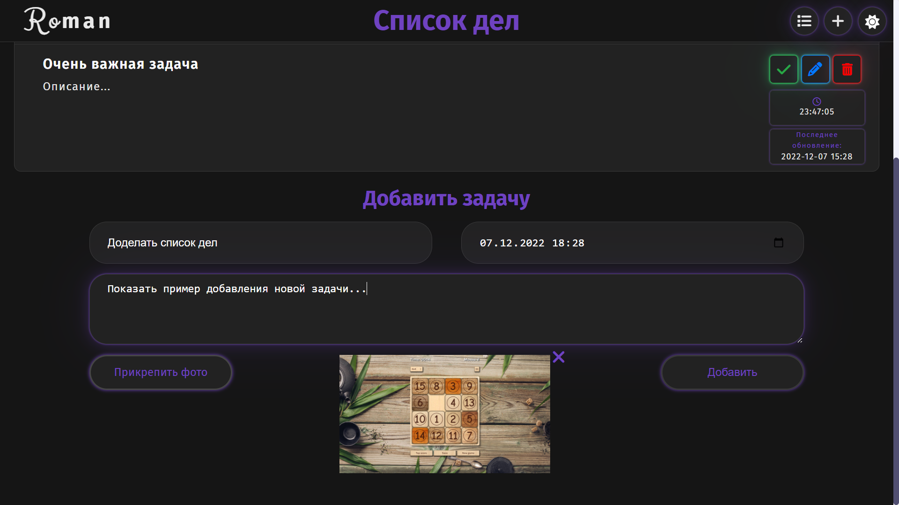

# [Список дел](https://romanchuchev.github.io/todo-list/)

---

## Запустить проект

#### `git clone [link]`

#### `npm install`

#### `npm start`

#### `npm run build`

## Функционал:

- создание, просмотр, редактирование (изменение полей или то, что задача выполнена) и удаление задачи;
- возможность прикрепления фотографии к записи;
- поля в задаче: заголовок, описание, дата завершения, последнее обновление, прикрепленная фотография;
- визуально отмечено, если дата завершения истекла или задача выполнена;
- код откомментирован код в JSDoc.
- использован firebase.google.com как Back-end и хостинг клиентской части;

## Стек технологий:

- React + routing
- React Hooks
- Firebase
- DayJS
- UUID
- JSDoc
